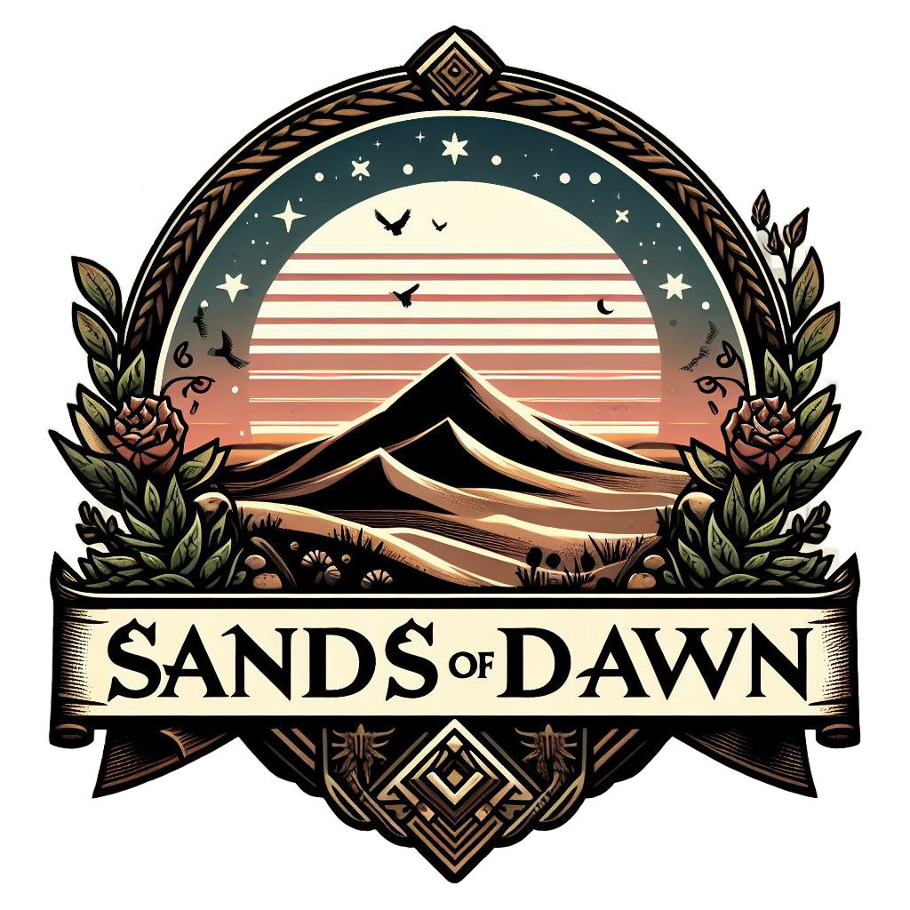

# Sands of Dawn



## Description
"Sands of Dawn" is a challenging soulslike game developed in Unreal Engine, written primarily in C++. The game is set in a mysterious desert environment where players must master combat mechanics, solve puzzles, and face powerful enemies to unravel the story.

## Features
- **Tactical Combat**: Engage in precise and strategic combat where every move matters.
- **Immersive World**: Explore vast desert landscapes filled with hidden secrets and dangers.
- **Challenging Enemies**: Encounter formidable foes and epic boss battles that test player skills.
- **Story-Driven**: Discover a rich lore behind the world of *Sands of Dawn*.

## Contributing
1. Fork the repository.
2. Create a new branch:
    ```
    git checkout -b feature/your-feature-name
    ```
3. Make your changes and submit a pull request.

## License
This project is licensed under the MIT License.

